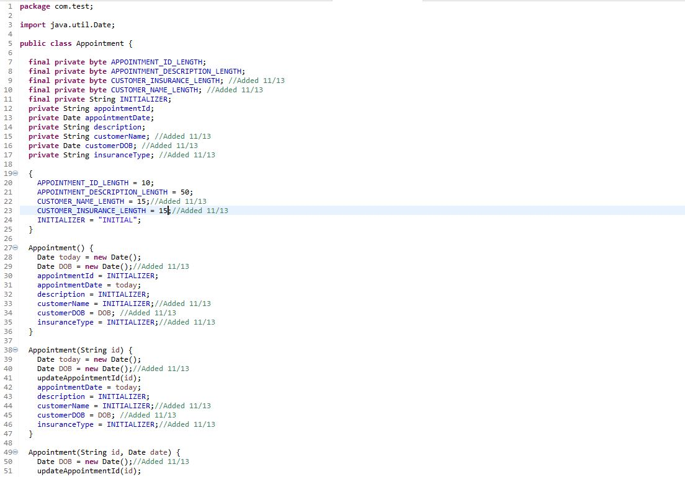
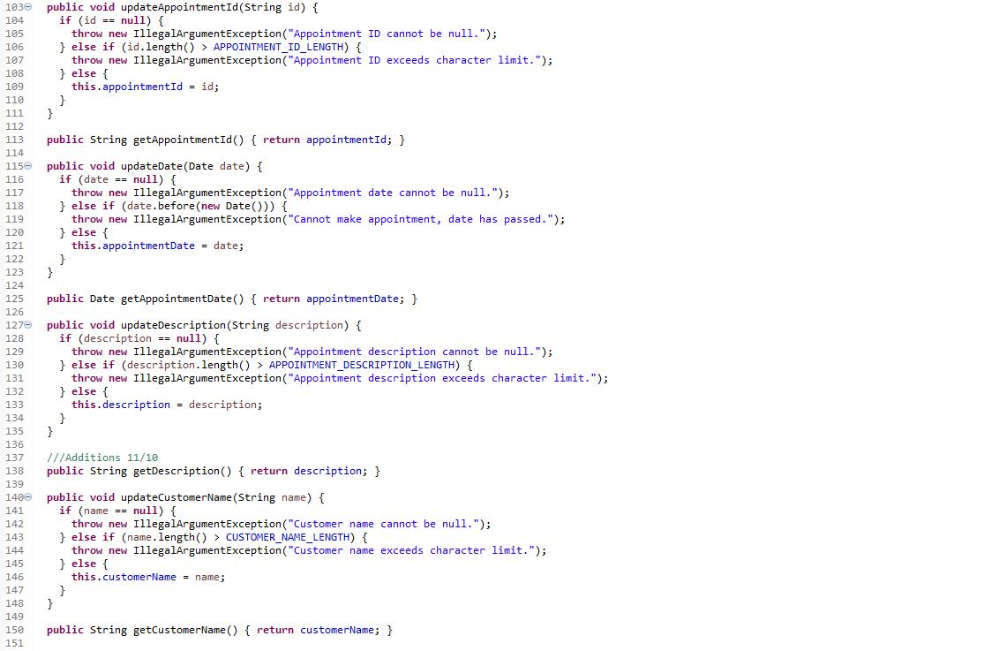
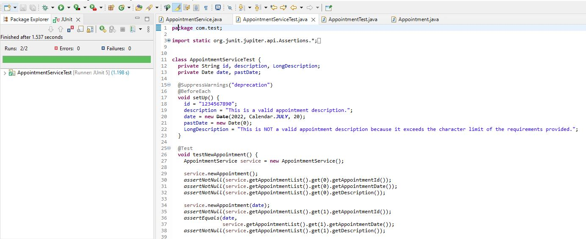

<!-- Main -->

<!-- One -->
<section id="one">
	

		<header class="major">
			<h1>Software Design and Engineering</h1>
		</header>

<!-- Content -->
<h2 id="content"></h2>

In this artifact, we have four Java files that operate as an appointment service, two of them work together to create and delete an appointment while the other two allow us to edit these appointments. This specific artifact showcases software design and engineering in a way that allows me to demonstrate knowledge in the addition of extra functionality, testing, and security. - https://bitbucket.org/xanderbell/cs499_art1/src/master/
	
Professor comments: For the final portfolio clean up a bit more and make sure you comment more with intent and decision for the overall functionality of each file in the header as well as inline so any programmer can hop in and edit. You talk about that you met outcomes, but you have to identify and then articulate which outcomes of the five and how you met one or more of those with each category enhancement. Solid work and with a few small updates, you are ready. Please review your grammar and spelling before submitting your next assignment. Your spelling and grammar can detract from your content expertise. Make sure you visit the writing center as they are very helpful, friendly and it is a free service for students. Java for example not java as that makes a big difference in the workplace.

	

		<h3>Code Analysis</h3>
		
				

			

		

				
	
					
Nunc lacinia ante nunc ac lobortis. Interdum adipiscing gravida odio porttitor sem non mi integer non faucibus ornare mi ut ante amet placerat aliquet. Volutpat commodo eu sed ante lacinia. Sapien a lorem in integer ornare praesent commodo adipiscing arcu in massa commodo lorem accumsan at odio massa ac ac. Semper adipiscing varius montes viverra nibh in adipiscing blandit tempus accumsan.

		

					
	
		
Nunc lacinia ante nunc ac lobortis. Interdum adipiscing gravida odio porttitor sem non mi integer non faucibus ornare mi ut ante amet placerat aliquet. Volutpat commodo eu sed ante lacinia. Sapien a lorem in integer ornare praesent commodo adipiscing arcu in massa commodo lorem accumsan at odio massa ac ac. Semper adipiscing varius montes viverra nibh in adipiscing blandit tempus accumsan.

		

		
		
		
Nunc lacinia ante nunc ac lobortis. Interdum adipiscing gravida odio porttitor sem non mi integer non faucibus ornare mi ut ante amet placerat aliquet. Volutpat commodo eu sed ante lacinia. Sapien a lorem in integer ornare praesent commodo adipiscing arcu in massa commodo lorem accumsan at odio massa ac ac. Semper adipiscing varius montes viverra nibh in adipiscing blandit tempus accumsan.

	

	

		<h3>Output Analysis</h3>
		
				

			

		

				
	
					
Nunc lacinia ante nunc ac lobortis. Interdum adipiscing gravida odio porttitor sem non mi integer non faucibus ornare mi ut ante amet placerat aliquet. Volutpat commodo eu sed ante lacinia. Sapien a lorem in integer ornare praesent commodo adipiscing arcu in massa commodo lorem accumsan at odio massa ac ac. Semper adipiscing varius montes viverra nibh in adipiscing blandit tempus accumsan.

		

					
	
		
Nunc lacinia ante nunc ac lobortis. Interdum adipiscing gravida odio porttitor sem non mi integer non faucibus ornare mi ut ante amet placerat aliquet. Volutpat commodo eu sed ante lacinia. Sapien a lorem in integer ornare praesent commodo adipiscing arcu in massa commodo lorem accumsan at odio massa ac ac. Semper adipiscing varius montes viverra nibh in adipiscing blandit tempus accumsan.

	

	<!-- Break -->
	

		<h3>Enhancements</h3>
		
 I have made enhancements to the two files that allow us to create and edit these appointments. The enhancements I have implemented allowed me to add extra fields for our appointment service, adding further capabilities. Being able to demonstrate well-founded and innovated techniques like junit testing and proper Java langauge uasge.

	

	

		<h3>Outcomes</h3>
		
Nunc lacinia ante nunc ac lobortis. Interdum adipiscing gravida odio porttitor sem non mi integer non faucibus ornare mi ut ante amet placerat aliquet. Volutpat eu sed ante lacinia sapien lorem accumsan varius montes viverra nibh in adipiscing blandit tempus accumsan.

	

	

		<h3>Reflections</h3>
		
Nunc lacinia ante nunc ac lobortis. Interdum adipiscing gravida odio porttitor sem non mi integer non faucibus ornare mi ut ante amet placerat aliquet. Volutpat eu sed ante lacinia sapien lorem accumsan varius montes viverra nibh in adipiscing blandit tempus accumsan.

	

<!-- Buttons -->
<h4></h4>
<ul class="actions vertical">
	<li><a href="https://xander325.github.io/xanderbell.github.io/artifact_three.html" class="button special fit">Next</a></li>
	</ul>

