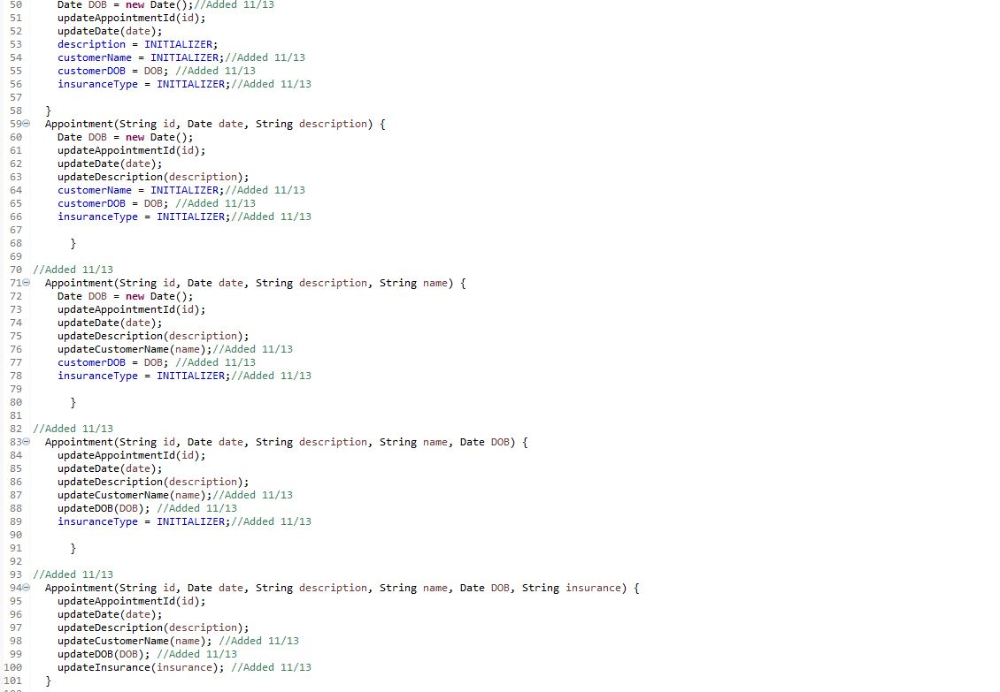
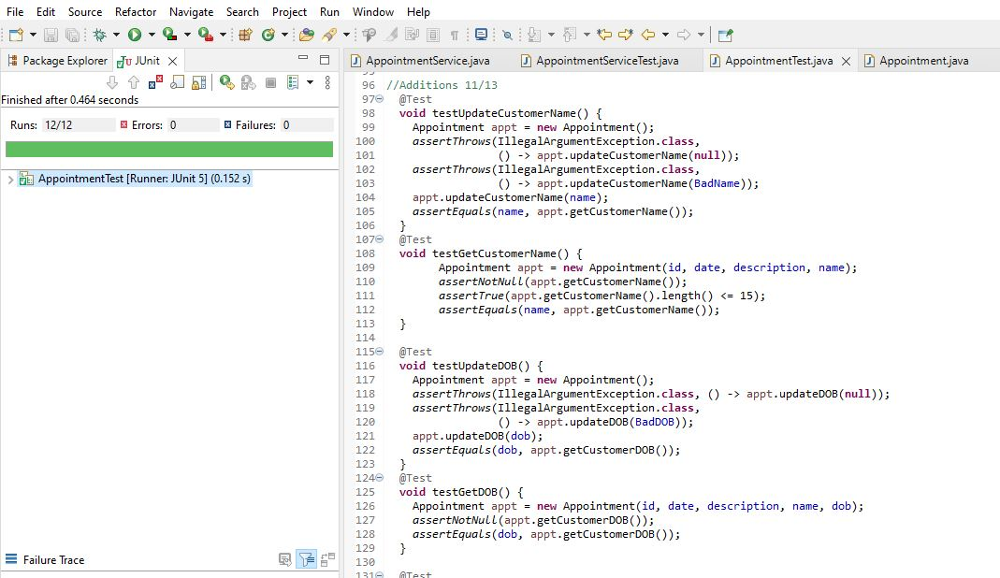

<!-- Main -->

<!-- One -->
<section id="one">
	

		<header class="major">
			<h1>Software Design and Engineering</h1>
		</header>

<!-- Content -->
<h2 id="content"></h2>

In this artifact, we have four Java files that operate as an appointment service, two of them work together to create and delete an appointment while the other two allow us to edit these appointments. This specific artifact showcases software design and engineering in a way that allows me to demonstrate knowledge in the addition of extra functionality, testing, and security.

	

		<h3>Code Analysis</h3>

First things first, we must understand the existing functionalities of this program. Using the eclipse IDE, we are using the Java language to develop a program that creates and/or updates an appointment. We have the following files, Appointment.java, appointmentTest.java and we have appointmentSerivce.java and appointmentserviceTest.java. These files and their matching test files work in conjunction to not only create a program but also test the functionalities of a program. The structure of these files show that the code is implemented correctly and conforms to pertinent standards, as we can see through indentations it is clear to read and doesn’t have identifiers used for multiple purposes and so on.

	

		<h3></h3>

		
This structure is consistent across all four of our files and there are no uncalled-for procedures and/or unreachable code implemented in our design. When taking a look at our test files, there is not any leftover test routines or anything along those lines; our tests here are designed to test the functionalities of our code, nothing more and nothing less. The way I designed this code and the way all code should be designed is in a modular fashion. Having the ability to replace sections and/or copy sections of this project and implement it into another is important. It is clear that we can do that with the code we have here; a good example of this is the setup portion for the test files, this is a very modular section and because of this, we are able to take this same setup structure and implement it elsewhere if need be.

	

	<!-- Break -->
	

		<h3>Enhancements</h3>
		
 I have made enhancements to the two files that allow us to create and edit these appointments. The enhancements I have implemented allowed me to add extra fields for our appointment service, adding further capabilities. Being able to demonstrate well-founded and innovated techniques like junit testing and proper Java langauge uasge.

	

	

		<h3>Outcomes</h3>
		
Nunc lacinia ante nunc ac lobortis. Interdum adipiscing gravida odio porttitor sem non mi integer non faucibus ornare mi ut ante amet placerat aliquet. Volutpat eu sed ante lacinia sapien lorem accumsan varius montes viverra nibh in adipiscing blandit tempus accumsan.

	

	

		<h3>Reflections</h3>
		
Nunc lacinia ante nunc ac lobortis. Interdum adipiscing gravida odio porttitor sem non mi integer non faucibus ornare mi ut ante amet placerat aliquet. Volutpat eu sed ante lacinia sapien lorem accumsan varius montes viverra nibh in adipiscing blandit tempus accumsan.

	

		
<!-- Buttons -->
<h4></h4>
<ul class="actions vertical">
	<li><a href="https://bitbucket.org/xanderbell/cs499_art1/src/master/" class="button fit">Bitbucket Repository Link</a></li>
	<li><a href="https://xander325.github.io/xanderbell.github.io/artifact_three.html" class="button special fit">Next</a></li>
	</ul>

