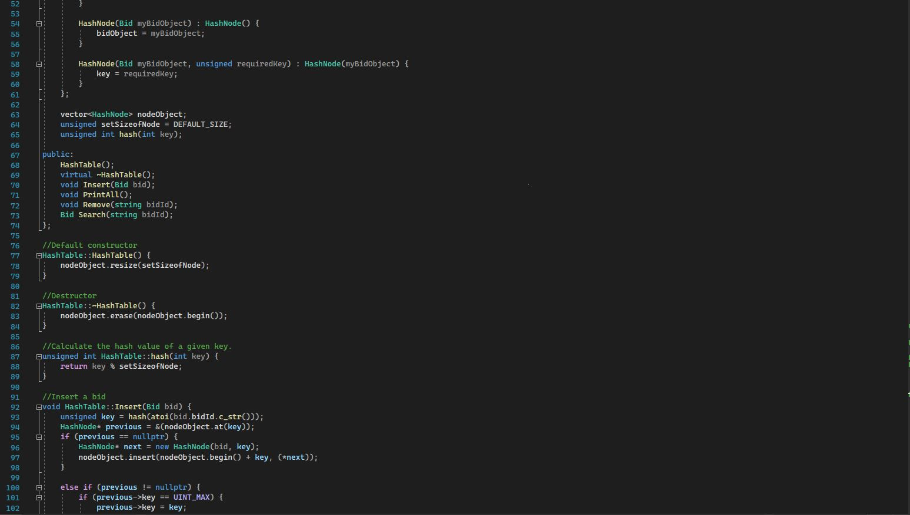

<!-- Main -->

<!-- One -->
<section id="one">
	

		<header class="major">
			<h1>Databases</h1>
		</header>

<!-- Content -->
<h2 id="content"></h2>

This program utilizes a CSV file and imports it into a hash table for our program to search through and remove items from the desired database and we have a dashboard of users to utilize. This assignment was from DAT220, it was broken when I initially pulled it from my files.

The goal of this artifact is to showcase databases and my competency with them. In efforts to reach our course outcomes; demonstrating an ability to use well-founded and innovative techniques and demonstrating a security mindset that anticipates adversarial exploits, designs to expose potential vulnerabilities, and mitigate design flaws, I felt this program was most applicable. The enhancements I have made here have revealed my abilities with software development as I have not only fixed the program and got it running from its original state but I have also implemented a fail-safe for the remove function, confirming with the user before removing a file.

Unfortunately, my initial plan to create a filter for the database didn’t work as well as a wanted with a hash table so instead, I decided it would be best to remain using hash tables and take a different approach to my enhancements. Ultimately, I was able to meet those same desired outcomes with the approach of implementing a user inputted a bid id search and a user inputted removal of record via bid ID.

It took me a quite a while to get the program to work properly and read a CSV file initially, I spent a ton of time fiddling with things over the past two days, Once I was able to get the program to build successfully and output the desired code, I felt I was finally getting somewhere. Then, I began playing around with different database techniques like a binary tree vs a hash tables. Untimely, I stuck to a hash table and changed my planned enhancements instead. I feel like the route I ended up going with worked best and technically, I made more enhancements than I would have with my original plan. It was helpful to circle back and work with databases and it was a nice refresher!

Professor comments: The enhancement is fitting for the category. I am concerned about your professional communication as there is a pattern of errors. You will need a lot of proofing and polish before the portfolio submission. Please visit the writing center for help so your skills are the focus. (Example: Untimely, I stuck to a hash table and changed my planned enhancements instead. ) Make sure your file has clear headers and addresses the intent and decisions made in the file….a You need to clearly highlight the before and after. Your narrative should also be updated to reflect this as well. This is an all or none score, and you have met the criteria for this instance of the milestone. For the final portfolio clean up a bit more and make sure you comment a bit more with intent and decision for the overall functionality of each file in the header as well as inline so any programmer can hop in and edit. You talk about how you that met outcomes so now be really specific with your enhancements and how they align. Solid work and with a few small updates, you are ready. 

	

		<h3>Code Analysis</h3>

		
We are analyzing a database in form of a CSV file and developing a program that can either create bids, load bids from a .csv file, display all bids, find bids, and remove bids. This program is created using C++ in the Microsoft visual studio IDE. This specific project focuses the implementation of a database through the use of loops, branches and even some defensive programming! Going through our code, we can see that all logic constructs are complete and properly nested. In turn, we obviously have the common cases first in our IF--ELSE statements. We can also see that each case has a proper break therefore we have a default for these case statements, that will inevitably exit our program; Because this is implemented, each case has loop termination conditions.  We can see that our menu/index is implemented before any of the switch cases, this ensures that our index is working and referenced correctly.

	

	

		<h3></h3>

		
The statements used in these loops must stay in the loops because it keeps our program from breaking and looping indefinitely upon input. The use of switch cases ultimately allows us to test our user input against the records and file bounds we have in place and because this program utilizes .csv files, we must have some level of defensive programming that ensures our file is valid and this is done through our command line arguments. Due to the fact that this program uses a CSV file, all output files are assigned to memory. "Return 0," at the end of our program is in place to ensure every memory allocation is then deallocated before exiting.

	

	<!-- Break -->
	

		<h3>Enhancements</h3>
		
 I have made enhancements to the two files that allow us to create and edit these appointments. The enhancements I have implemented allowed me to add extra fields for our appointment service, adding further capabilities. Being able to demonstrate well-founded and innovated techniques like junit testing and proper Java langauge uasge.

	

	

		<h3>Outcomes</h3>
		
Nunc lacinia ante nunc ac lobortis. Interdum adipiscing gravida odio porttitor sem non mi integer non faucibus ornare mi ut ante amet placerat aliquet. Volutpat eu sed ante lacinia sapien lorem accumsan varius montes viverra nibh in adipiscing blandit tempus accumsan.

	

	

		<h3>Reflections</h3>
		
Nunc lacinia ante nunc ac lobortis. Interdum adipiscing gravida odio porttitor sem non mi integer non faucibus ornare mi ut ante amet placerat aliquet. Volutpat eu sed ante lacinia sapien lorem accumsan varius montes viverra nibh in adipiscing blandit tempus accumsan.

	

<!-- Buttons -->
<h4>Actions</h4>
<ul class="actions vertical">
	<li><a href="https://xander325.github.io/xanderbell.github.io/artifact_two.html" class="button special fit">Next</a></li>
	</ul>

