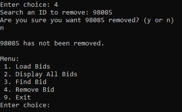
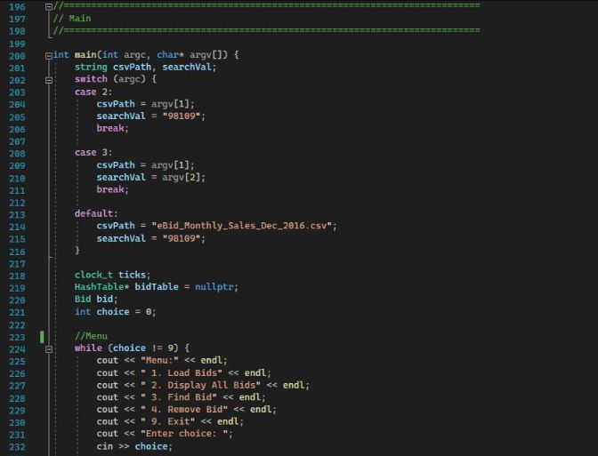
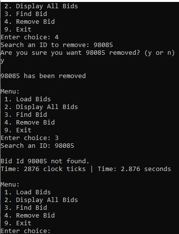

<!-- Main -->

<!-- One -->
<section id="one">
	

		<header class="major">
			<h1>Databases</h1>
		</header>

<!-- Content -->
<h2 id="content"></h2>

This program utilizes a CSV file and imports the file into a hash table for our program to search through and remove records from. The user utilizes a dashboard to access and edit this database.

	

		<h3>Code Analysis</h3>

We are analyzing a database in form of a CSV file and have developed a program that can either  load bids from a CSV file, display bids, find bids, and/or remove bids. This program is created using C++ in the Microsoft Visual Studio IDE. This specific project focuses the implementation of a database through the use of loops, branches and even some defensive programming! Going through our code, we can see that all logic constructs are complete and properly nested. In turn, we obviously have the common cases first in our IF--ELSE statements. We can also see that each case has a proper break therefore we have a default for these case statements, that will inevitably exit our program; Because this is implemented, each case has loop termination conditions.  We can see that our menu/index is implemented before any of the switch cases, this ensures that our index is working and referenced correctly.

The statements used in these loops must stay in the loops because it keeps our program from breaking and looping indefinitely upon input. The use of switch cases ultimately allows us to test our user input against the records and file bounds we have in place and because this program utilizes CSV files, we must have some level of defensive programming that ensures our file is valid and this is done through our command line arguments.

		

	

		<h3></h3>

	

	<!-- Break -->
	

		<h3>Enhancements</h3>

I made several enhancements here as the program was not working initially. My goal was to implement a user-inputted search function and a user-inputted removal function. While maintaining coherent and consistent code I was able to implement these functions in a relatively modular fashion making them easy to add onto and edit if needed. Through testing, it was apparent that it was very easy for a user to delete a record, so I also went ahead and implemented a failsafe requiring the user to confirm before the deletion a record.

	

	

		<h3>Outcomes/Reflections</h3>

The implementation of these enhancements showcases my ability to not only use innovative techniques but also maintain consistent and modular code while also following industry-standard designs. With my coherent enhancements, it very clear what additions were made, and which block of code is doing what. When testing and creating the confirmation portion of my deletion feature, I was able to show case my ability again to think as an adversary.  The usage of these skills is important in software development because all of these skills work in conjunction to create a competent software engineer!

       

		
<!-- Buttons -->
<h4></h4>
<ul class="actions vertical">
	<li><a href="https://bitbucket.org/xanderlbell/artifact_3_enhanced/src/master/" class="button fit">Bitbucket Repository Link (Enhanced Files)</a></li>
	<li><a href="https://bitbucket.org/xanderlbell/artifact_3_orginal/src/master/" class="button fit">Bitbucket Repository Link (Original Files)</a></li>
	<li><a href="https://xander325.github.io/xanderbell.github.io/artifact_two.html" class="button special fit">Next</a></li>
	</ul>

