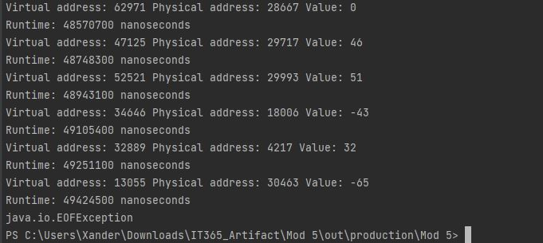
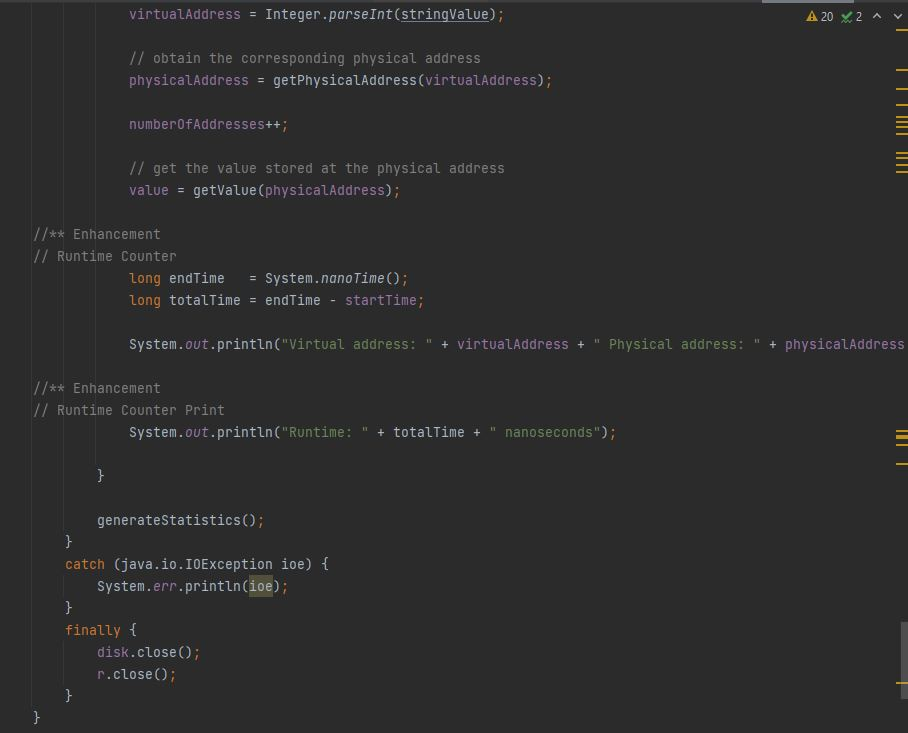

<!-- Main -->

<!-- One -->
<section id="one">
	

		<header class="major">
			<h1>Algorithms and Data Structures</h1>
		</header>

<!-- Content -->
<h2 id="content"></h2>

In this artifact we have five Java files that all work in conjunction to run our main file, VM.java, and this file utilizes a text file populated with virtual addresses and converts them into physical addresses to ultimately simulate the algorithms and data structures that an operating system (Like Windows OS) deal with.

	

		<h3>Code Analysis</h3>

For category two, Algorithms and Data Structures we have more Java files that work in conjunction to simulate an operating system by utilizing algorithms and data structures to manage all it's components. More specifically, the focus here is about Windows OS and how it goes about managing processes, memory, files, and system resources through algorithms and data structures. This uses six Java files: PageTableEntry, TLBEntry, VM, MakeBACKING_STORE, Frame, and Address. These six files allow the user to input a given page size and virtual address and calculate the page number and offset.

	

		<h3></h3>

While this code may be a little hard to follow at first glace, we can clearly see what is what when following the comments provided; Here we can see what section of the code is doing what and it is very consistent with the code itself. When analyzing the variables here, we can see that all of these variables we are working with, FRAME_Size, or ADDRESS_SIZE are all self explanatory; Naming is consistent and clear. We can also see that the consistency between the type of variables and the casting of these variables.

	

	<!-- Break -->
	

		<h3>Enhancements</h3>
		
 For enhancements here I focused on implementing runtime feature. Albeit, my enhancements were small they do help put into perspective how fast a computer processes. Even when modifying our data structures and adding in an algorithm like a runtime tracker, it still seems uneffected. It is also helpful that we do not have any redundant or unused variables; All the of the code we have here is necessary.

	

	

		<h3>Outcomes/Reflections</h3>
		
Being able to design and provide solutions using algorithmic principles and computer science practices allows us to create effecient programs. This also helps manage the trade-offs invloved in design choices because we have an opertunity to become more aware of the capabilities of ourselves and our algorithms. While algorithms are used within all of these artifacts, this specific artifact showcases the complex logic problems inherent in software.

       

		
<!-- Buttons -->
<h4></h4>
<ul class="actions vertical">
	<li><a href="https://bitbucket.org/xanderlbell/artifact_2_enhanced/src/master/" class="button fit">Bitbucket Repository Link (Enhanced Files)</a></li>
	<li><a href="https://bitbucket.org/xanderlbell/artifact_2_orginal/src/master/" class="button fit">Bitbucket Repository Link (Orginal Files)</a></li>
	<li><a href="https://xander325.github.io/xanderbell.github.io/" class="button special fit">Back Home</a></li>
	</ul>

